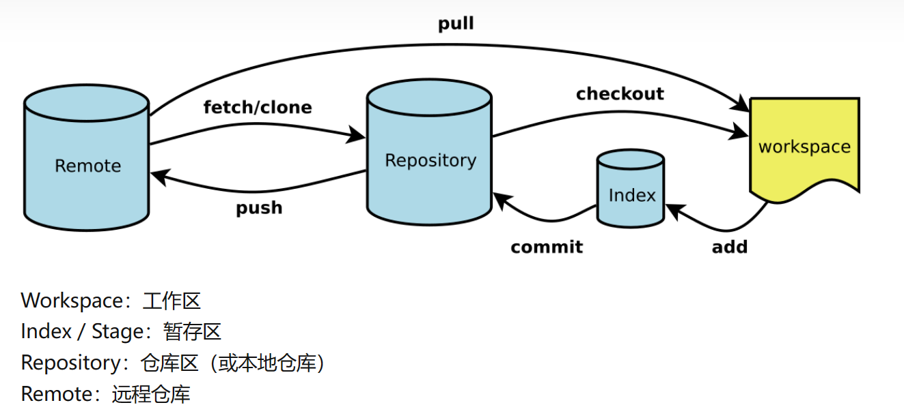

# 1 级标题
## **2 级标题加粗体字**
### 3 级标题
#### 4 *级标题*


单独的代码块
```C#
for(int i = 1; i <1; i++)
{
    Console.Writeln($"i x i = {i*i});
}
```

在文本中嵌入代码
``python
 print("Welcome to Python world)
 ``

无序列表

- 123
  - 456
    - 789

有序列表
1. 123
2. 456
3. 789
  
*斜体字*


**粗体字**


应用快
> Blockquote

分割线
--------------------


链接
[我的Github/VSC_repo链接](https://github.com/GeorgeXing66/VSC_Repo)

表格
| 第一行第一列|第一行第二列|
|-----------|----------- |
|第二行第一列|第二行第二列|
|第三行第一列|第三行第二列|

脚本
[^1]
[^1]： This is the footnote.


删除线
~~这里是删除线~~

任务列表
- [x] 首要工作
- [ ] 次要工作
- [ ] 提醒

- [x] Write the press release
- [ ] Update the website
- [ ] Contact the media

图片嵌入 1


图像嵌入 2



---------------


------------
图像嵌入带对中
<div align = center />


