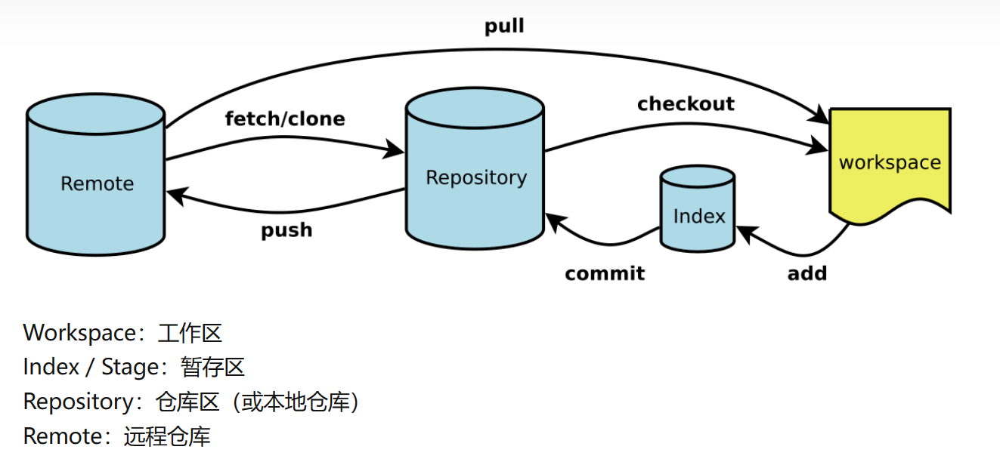
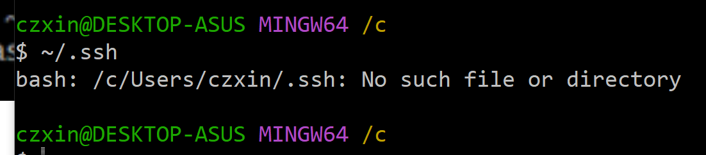
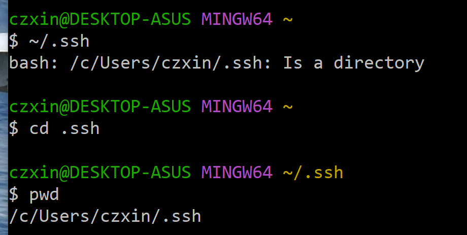
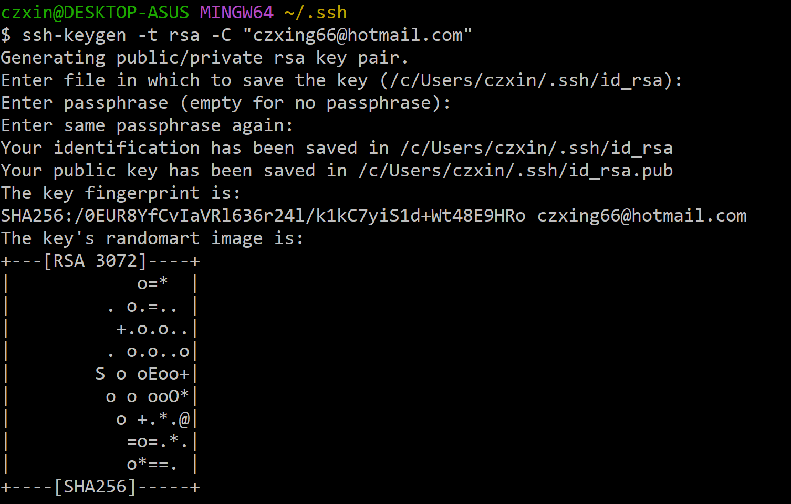
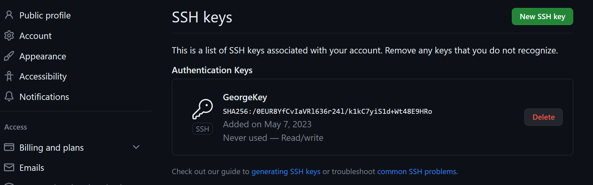
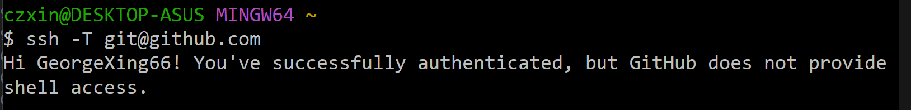
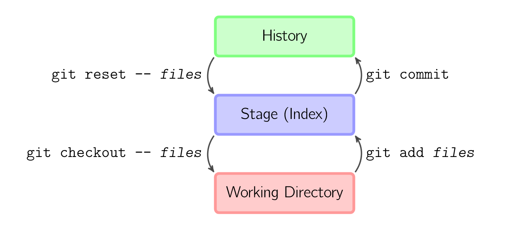
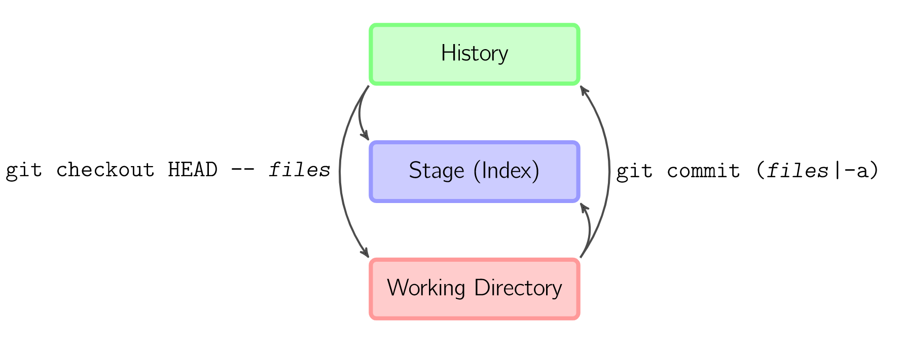

<div style="text-align: center">

# **Git 学习笔记**
by Geeorge

</div>


<div style="text-align: left">

## Git 简介
Git是世界上先进的 **「分布式的版本控制系统」**

</div>

## Git 构造图


## Git 的四个区域
- 工作区(Worksapace)：用于创建，编辑，修改文件的区域称为工作的区域（即做项目写代码的区域）
- 暂存区(Index/Staging area)：存放已完成工作的临时存放区域，等待被提交
- 本地仓库(Local Repository)：存放数据的地方，但是还在本地电脑上，若电脑存储空间损坏还是会造成代码消失
- Git远程仓库(Remote Repository)：最终的存放区域，即远程服务器，电脑存储空间损坏也不影响远程仓库数据

##  Git 如何标识文件的状态
- 未跟踪(Untracked)：在工作区内新建的文件还没有纳入Git体系，故而文件处于未跟踪状态。
- 已暂存(staged)：使用 git add *fileName* 命令将新文件或修改过的文件加入暂存区，此时文件处于已暂存状态。
- 已提交(Unmodified)：使用 git commit -m *filleName* 命令将文件从暂存区保存到本地Git仓库，此时文件处于已提交状态
- 已修改(Modified)：对已被跟踪的文件做修改后，还没将修改后的文件放到暂存区，此时文件处于已修改状体。

区域和文件状态图示如下：


## Git 配置

用户信息：
```git
$ git config --global user.name "GeorgeXing66"
$ git config --global user.email "czxing66.com"
```
通常有三个级别配置:
 
1. --global  use global config file
2. --system use system config file
3. --local use repository config file


## 查看配置信息

命令格式
git config --list，示例如下：
```git
czxin@DESKTOP-ASUS MINGW64 ~
$ git config --list
diff.astextplain.textconv=astextplain
http.sslbackend=openssl
http.sslcainfo=C:/Program Files/Git/mingw64/etc/ssl/certs/ca-bundle.crt
core.autocrlf=true
core.fscache=true
core.symlinks=true
pull.rebase=false
credential.helper=manager
credential.https://dev.azure.com.usehttppath=true
init.defaultbranch=master
user.name=GeorgeXing66
user.email=czxing66@hotmail.com
```

## 生成 Git 密钥(ssh)
- 执行 ~/.ssh检查是否生成ssh文件夹,示例如下

<dit align = center/>


- 创建 .ssh 文件夹，然后进入 .ssh 文件夹



- 执行 ssh-keygen 产生公匙和私匙



## 使用 SSH 关联 Git 和 Github

- 将公匙的值粘贴到你的 github 账户的 SSH



- 测试关联




## Git Bash 基本目录操作命令
0. 查看当前目录
```git
czxin@DESKTOP-ASUS MINGW64 ~
$ pwd
/c/Users/czxin
```
1. 打开目录
```git
czxin@DESKTOP-ASUS MINGW64 /c
$ cd c:/users/czxin
czxin@DESKTOP-ASUS MINGW64 /c/users/czxin
```
2. 返回初始目录
```git
czxin@DESKTOP-ASUS MINGW64 /c/users/czxin
$ cd
czxin@DESKTOP-ASUS MINGW64 ~
```
3. 创建新目录
```git
czxin@DESKTOP-ASUS MINGW64 ~
$ mkdir test
czxin@DESKTOP-ASUS MINGW64 ~
$ cd test
czxin@DESKTOP-ASUS MINGW64 ~/test
$ pwd
/c/Users/czxin/test
```
4. 查看Git状态
```git
$ git status     长格式
$ git status -s  短歌
```

## Git 创建仓库
- 创建一个文件夹
- 初始化仓库，
- 成功的标志是文件夹后有(master)标志成功
```git
czxin@DESKTOP-ASUS MINGW64 ~/documents
$ cd vsc_文档
czxin@DESKTOP-ASUS MINGW64 ~/documents/vsc_文档 (master)
$ git init
Reinitialized existing Git repository in C:/Users/czxin/Documents/VSC_文档/.git/
```

## Git 一般工作流
- 克隆 Git 资源作为工作目录。
- 在克隆的资源上添加或修改文件。
- 如果其他人修改了，你可以更新资源。
- 在提交前查看修改。
- 提交修改。
- 在修改完成后，如果发现错误，可以撤提交并再次修改并提交。

<dit align = center/>


## Git 基本用法

下图展示了Git的四条基本命令，如何在工作目录、暂存目录(也叫做索引)和仓库之间复制文件。

<dit align = center/>


- git add *files* 把当前文件放入暂存区域。
- git commit 给暂存区域生成快照并提交。
- git reset -- *files* 用来撤销最后一次git add *files*，你也可以用git reset 撤销所有暂存区域文件。
- git checkout -- *files* 把文件从暂存区域复制到工作目录，用来丢弃本地修改。

也可以跳过暂存区域直接从仓库取出文件或者直接提交代码。

<dit align = center/>


- git commit -a 相当于运行 git add 把所有当前目录下的文件加入暂存区域再运行 git commit.
- git checkout HEAD --*files* 回滚到复制最后一次提交。


